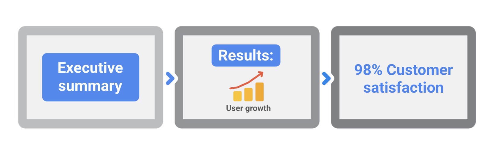

# Closing a project

## The impact of skipping project closure steps
In order to close a project, you must ensure that:
- All work is done.
- All agreed-upon project management processes have been executed.
- You have received formal recognition and agreement from key stakeholders that the project is done.

## Avoiding the impact of project closure oversights
Oversights or skipping steps in the closing phase of a project can:
- Impact the product’s or service’s scheduled launch dates.
- Put your organization at legal risk.
- Result in significant financial losses to your organization.
- Undermine your team's credibility, and yours.
- Damage your relationship with the customer or client.

All of the steps of the project life cycle—initiating the project, making a plan, executing and completing tasks, and closing the project—are essential for a successful outcome. Unfortunately, closing the project is a phase that too often gets skipped, which can negatively impact both the project manager and their organization. To avoid these issues, make sure to plan for this phase just as you would any of the other project life cycle phases.

## Demonstrating project impact to stakeholders
A formal closing process is essential because improper closing may leave you at risk for incomplete contracts and scope. It is also important to make sure that all stakeholders feel like their needs are met and to review areas for improvements in the future.

### Highlight key performance areas
The purpose of your impact report is to show your key stakeholders the impact your project had on the organization. Goals, objectives, budget, schedules, and key performance indicators (KPIs) need to be determined at the beginning of your project. Your impact report should demonstrate how well you did against those early targets. In your report, you should also answer the question: What was the problem we were trying to solve, and how did we solve it? This will help you showcase the value your project outcome brought to the business. Highlight these key performance areas to demonstrate to your stakeholders how you achieved successful results and outcomes:
- First, describe the goals and objectives you set for the project and what you hoped to have achieved by the end. 
- Then, describe how you met those objectives against your KPIs. A KPI is a measurable value that demonstrates how effective a company is at achieving their objectives. In your impact report, review how you defined the success of your project at the beginning, and highlight the outcomes you achieved that demonstrate this success.
- Finally, showcase your schedule and budget performance by outlining your cost savings and efficiencies. Demonstrate that you met the deadlines set in your project scope and that your project was completed within budget.

### Use metrics to showcase your results
Use facts and statistics to highlight the results you achieved related to the performance areas described in the section above. Examples of common metrics you might include to demonstrate a positive impact could include: 
- Improvement in schedule performance
- Revenue growth
- Positive return on investment (ROI)
- Increased external user counts
- Increased percentage of internal users 
- Cost vs. margins
- High percentage of customer satisfaction 
- Reduction in overhead
- Reduction in technical issues
- Time saved

As a project manager, impact reporting is a great opportunity to demonstrate the impact of your project and the value you bring to your organization. By highlighting key performance areas, using metrics to showcase results, and preparing an effective presentation, you can impress your stakeholders and convince them of your project’s success.

