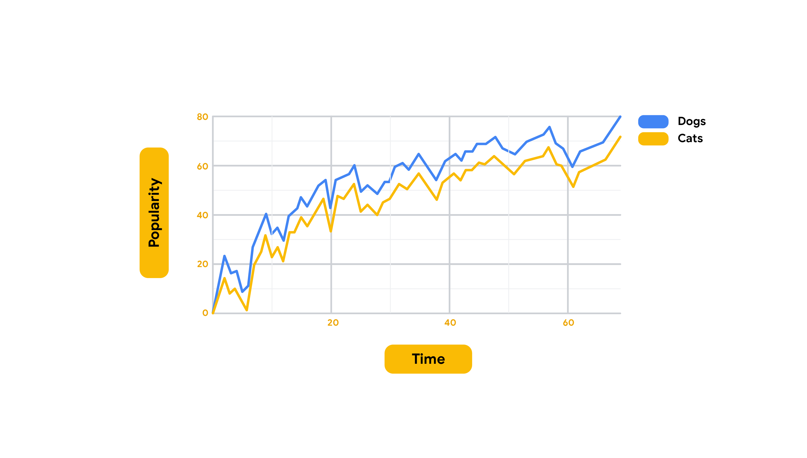

# Data-informed decision-making
## Common data metrics for project management
There are many types of project data you can use to determine your team’s progress and efficiency, evaluate the success of your project, and inform project decisions. While you don't need to be a data expert, knowing how to measure, track, and evaluate the right kind of data will help you deliver the most value and impact. 

### The benefits of analyzing data in project management

As a project manager, you can use data daily to make better decisions, solve problems, improve performance and processes, and understand your users. For example, if you have data on customer buying patterns, you can identify your best-selling products, and you'll be able to make smarter decisions when placing new product orders with your suppliers. This data will also help you better understand your users and their preferences so you can improve your product offerings and performance. You can also use project team data to help you refine your processes. For example, if your team is experiencing an issue, analyzing data from your project tracker about the number of tasks completed, escalations, or internal process problems can help you find the source. This will allow you to make an informed decision about where to focus your efforts to improve processes. Through critical analysis, application, and execution, data becomes a powerful tool to guide any project in the right direction.

### Data, metrics, and analytics

Data is information. It’s the numbers and feedback available to you about different aspects of your project. Metrics are how you measure your data. They define the important or specific information (data) you need to know about your project, such as productivity, quality, or engagement. Once you determine your project's metrics, you analyze the data according to those metrics to find patterns and answer questions about your project. This process is called analytics: using data to answer questions, discover relationships, and predict unknown outcomes. When analyzing data, ask: What do the metrics mean to you? How do you want to use the metrics you've chosen? Can you find patterns to make predictions about your project? Can you find ways to improve—or optimize—certain aspects of your project? What lessons can you draw from your project's data?

### Key takeaway
Data, metrics and analytics are all important to the success of your project. You'll need to have some familiarity with how to collect and measure data, and how to use the data to tell you about different aspects of your project. Depending on the project and its unique goals, some metrics will be more important than others. It's your job to make sure you understand which metrics your stakeholders are most interested in and what elements impact your team's ability to deliver quality results on time and within budget.

## Data ethics considerations
As a project manager, data collection and analysis will be a key part of your projects. As you’ve learned, you’ll collect data from a variety of sources, including focus groups, interviews and questionnaires. The data you collect will usually hold PII (personally identifiable information)—information that could be used to directly identify, contact, or locate an individual. A lot of times, you will also need to report on the data you collect to stakeholders, customers, and your project team. Collecting, analyzing, and sharing this data in an ethical way is extremely important for maintaining the integrity of your organization, your projects, and your position.

Data ethics is the study and evaluation of moral challenges related to data collection and analysis. This includes generating, recording, curating, processing, sharing, and using data in order to come up with ethical solutions. Businesses apply data ethics practices so they can:
- Comply with regulations
- Show that they are trustworthy
- Ensure fair and reasonable data usage
- Minimize biases
- Develop a positive public perception

Data ethics is rooted in several principle inluding: data privacy and data bias.

### Key takeaway
According to the Project Management Institute’s [Code of Ethics & Professional Conduct](https://www.pmi.org/about/ethics/code#:~:text=Ethics%20is%20about%20making%20the,absolutely%20dependent%20on%20ethical%20choices.), "Ethics is about making the best possible decisions concerning people, resources, and the environment. Ethical choices diminish risk, advance positive results, increase trust, determine long term success, and build reputations. Leadership is absolutely dependent on ethical choices."

A key way you can show your leadership skills is by exercising sound judgment when it comes to data ethics. In order to tell a project’s data-informed story to stakeholders, project team members, and others in an ethical way, you have to make sure you think about both privacy and bias-related concerns in how you conduct, analyze, and share that data.

## The six steps of data analysis
Data analysis is the process of collecting and organizing information to help draw conclusions, solve problems, make informed decisions, and support your goals. There are six main steps involved in data analysis: 
- ask
- prepare
- process
- analyze
- share
- act

## Different ways to visualize data
Before translating your data into a chart or graph, you should be clear on what you want to show your audience. Figure out what data you want to use and why. You might want to inform your audience about a new trend or a valuable piece of information, or show relationships between data sets. Or maybe you need to compare values, understand the composition of something, or analyze trends and behaviors over set periods of time. The type of data you have, and the information you want to show or understand, will help you figure out the right data visualization to use. Let's go over some scenarios and discuss which charts and graphs would be best for each.  

### Show relationships
A scatter plot, sometimes referred to as a scatter chart or scatter graph, uses dots to represent values for two different variables. The position of each dot on the horizontal and vertical axis indicates values for an individual data point. Scatter plots will sometimes have a line drawn across its center. This line is known as the trend line and highlights the direction the points are trending towards. 

Scatter plots show the relationship between data sets, and can help us understand the impact of one factor on another. For example, the scatterplot below shows the relationship between the life expectancy of people living in a country and how happy those people are. The first variable, the happiness score, is reflected on the vertical axis —also called the y-axis. The second variable, life expectancy, is on the horizontal axis —also called the x-axis. By looking at this scatterplot, we can tell that as a person’s happiness score increases, so does their life expectancy. 

#### Scatter plot best practices: 
- Start the y-axis at 0 to represent data accurately.

### Comparing values
Bar graphs use size contrast to compare two or more values. In the example below, the time of day is compared to someone’s level of motivation throughout the whole work day. By comparing this data, we can tell that this person’s motivation is low at the beginning of the work day, and gets higher and higher by the end. Bar graphs are also a great way to clarify trends and identify patterns. 

#### Bar graph best practices:
- Use consistent colors throughout the chart
- Use accent colors to highlight important data points or changes over time
- Use horizontal labels so it is easier to read 

### Demonstrating composition 
Now let’s check out another visualization you will probably recognize—the pie chart. Pie charts show us the composition of something. In other words, how much each part of something makes up the whole. The pie chart below shows us all the activities that make up someone’s day. Half of it is spent working, which is shown by the amount of space that the blue section takes up. From a quick glance at this pie chart, you can easily tell which activities make up a good chunk of the day and which ones take up less time.

#### Pie chart best practices: 
- Avoid including too many categories so it is easy to compare slices
- Make sure that the slice values add up to 100%
- Order slices according to their size

### Analyzing trends and behaviors  
Tracking trends can help us understand shifts or changes in our data. Line graphs are a great tool for visually showing change over time, but they can be paired with other factors, too. In the line graph below, we are using two lines to compare the popularity of cats and dogs over a period of time. Because the graph is using two different line colors, we can instantly tell that dogs are more popular than cats. We will talk more about using colors and patterns to make visualizations more accessible to audiences later, too. Even as the lines move up and down, there is a general trend upwards, and the line for dogs always stays higher than the line for cats.

#### Line graph best practices:
- To avoid clutter, don't show more than four categories.
- Organize highly variable data at the top of the chart to make it easy to read
