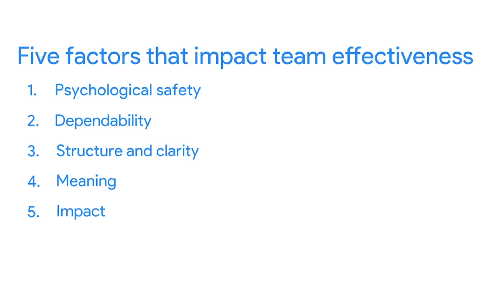
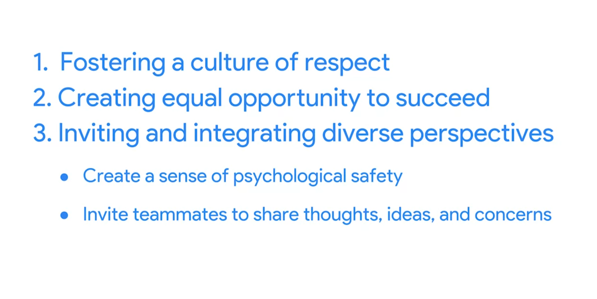
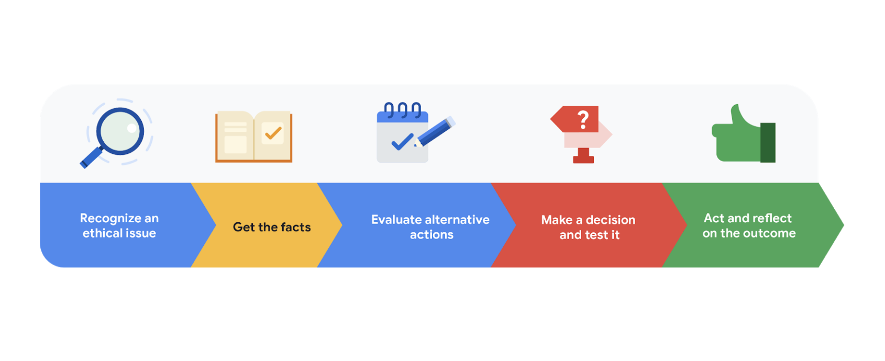
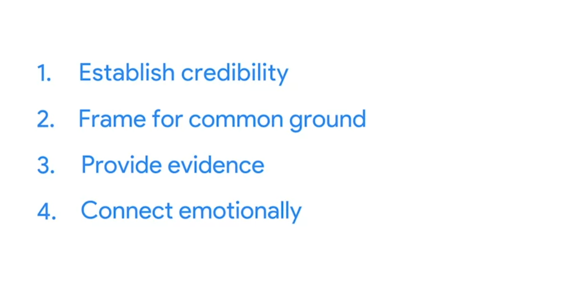

# Leadership and influencing skills

## Providing “air cover” to your team
Project managers build teams that meet project goals in many different ways, from delegating responsibility and prioritizing tasks to promoting trust and psychological safety. But there is another skill great project managers have that we will cover in this reading: the ability to provide air cover to protect their team. Air cover refers to support for and protection of a team in the face of out-of-scope requests or criticism from leadership. 

Providing air cover for your team takes practice. It requires a careful balance of the needs of your stakeholders and the needs of your project team. As you become more experienced in leading projects, you will develop a stronger sense of how to manage nuanced situations like these and provide the air cover your team needs to do their best work. 

## A framework for ethical decision-making
Ethical leadership is a form of leadership that promotes and values honesty, justice, respect, community, and integrity. As the leader of a project team, you will be expected to help your team succeed by leading with ethics. Building respect and trust with the teams you work with—from individuals to external partners to project stakeholders—begins with practicing ethical conduct. 

Ethics can be defined as the principles of conduct governing an individual or a group. However, there is no single, universally-accepted grouping of ethical standards—these definitions differ based on the culture and community at your company. In the working world, ethical standards may differ based on profession, industry, and organization. Usually, an organization will have its own code of conduct which specifies the standards to which it holds its employees accountable. 

### Key takeaway 
A framework like this one can help you feel better-equipped to make ethical decisions regarding your project and team, which is a central component of ethical leadership. Like so much of project management, ethical leadership takes diligence and practice, and it is crucial to build this skill. As you become more comfortable leading project teams, you will strengthen your ability to make decisions that you can feel good about. Gaining trust and respect from the people you work with can make it easier to influence without authority. If those around you trust your decision-making, they may be more likely to try to help you achieve project goals, even if you aren’t their direct manager. 

## Creating an effective influencing statement
Introductions in literature are important. Think of the opening lines of a good book—they help set the tone for what the reader can expect going forward. Introductions are important in project management too, especially when you are hoping to influence a stakeholder to consider and approve a new plan or idea. 

Throughout your career in project management, there will be times when you will need to influence someone to consider an idea, approve a plan, or complete a project task. Conger’s four steps provide a useful framework for thoughtfully approaching conversations that are important to project success and influencing stakeholders. Let’s explore each step further before applying them to an influencing statement:

### Establish credibility
When trying to persuade another person to listen to you, it helps to establish credibility. Ask yourself, why should this person listen to you? According to Conger, it is best to draw credibility from both expertise and relationships. 

You can build credibility by showing a level of expertise on the topic at hand. It also helps to have “a history of sound judgement.” If you find that you lack expertise on a subject, don’t worry! You can work to increase your knowledge through education or research, or you can even ask an expert for help.

You can also build credibility through strong relationships with your audience and others around you. Conger found that influential leaders tend to show their trustworthiness and willingness to do right by their colleagues over time, and in turn, people are more likely to listen to them.

### Frame for common ground
The next step in effectively persuading people is to frame for common ground. You can do this by making a case for how your idea would benefit your audience, and you can determine how your ideas will benefit your audience by gaining a strong understanding of them and what they value. Pay close attention to what matters to your audience by listening carefully and gathering information during meetings and conversations. Then frame your ideas based on your audience’s needs and interests. 

### Provide evidence
The third step is to provide evidence that supports your ideas. As Conger notes, though numbers are important, the best persuaders pair numbers with vivid language. They share stories, examples, and metaphors to help influence their audiences. Using vivid language can help bring your figures to life and draw stakeholders’ interest to your proposal.

### Connect emotionally
The fourth step is to connect emotionally with your audience. In this step, you illustrate that you are emotionally invested in the idea that you are presenting. But crucially, Conger notes, you must also do your best to determine and match the emotional state of your audience.

### Key takeaway
In this influencing statement, the project manager:
- Provided evidence from company surveys to set the stage for her proposal.
- Framed for common ground by noting how a new onboarding process might increase employee productivity.
- Established credibility by outlining her previous experience with launching similar processes.
- Connected emotionally by encouraging her audience to reflect on past experiences they may have endured as a new hire. 

By opening with a strong influencing statement, you can set yourself up for a successful conversation that is more likely to persuade your audience and achieve your goals.

