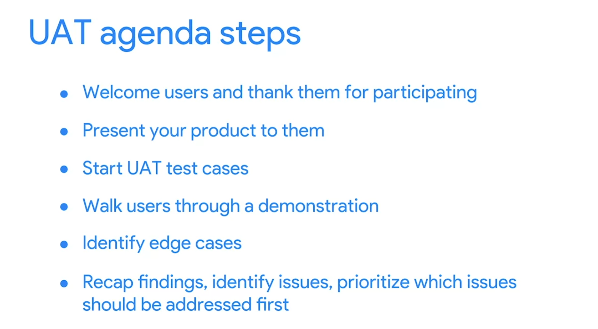

# Quality management and continuous improvement

## Quality management concepts
Let's review the four main concepts of quality management: quality standards, quality planning, quality assurance, and quality control.
- **Quality standards** provide requirements, specifications, or guidelines that can be used to ensure that products, processes, or services are fit for achieving the desired outcome. These standards must be met in order for the product, process, or service to be considered successful by the organization and the customer. You will set quality standards with your team and your customer at the beginning of your project. Well-defined standards lead to less rework and schedule delays throughout your project.
- **Quality planning** involves the actions of you or your team to establish and conduct a process for identifying and determining exactly which standards of quality are relevant to the project as a whole and how to satisfy them. During this process, you'll plan the procedures to achieve the quality standards for your project.
- **Quality assurance**, or QA, is a review process that evaluates whether the project is moving toward delivering a high-quality service or product. It includes regular audits to confirm that everything is going to plan and that the necessary procedures are being followed. Quality assurance helps you make sure that you and your customers are getting the exact product you contracted for.											
- **Quality control**, or QC, involves monitoring project results and delivery to determine if they are meeting desired results. It includes the techniques that are used to ensure quality standards are maintained when a problem is identified. Quality control is a subset of quality assurance activities. While QA seeks to prevent defects before they occur, QC aims to identify defects after they have happened and also entails taking corrective action to resolve these issues.

## User acceptance testing: Goals, best practices, and management
A user acceptance test or a UAT, is a test that helps a business make sure that a product or solution works for its users. A UAT must meet the agreed-upon requirements and deliver the expected results.

### The goals of UAT
To recap, UAT is testing that helps a business make sure that a product, service, or process works for its users. The main objectives of UAT are to:
- Demonstrate that the product, service, or process is behaving in expected ways in real-world scenarios. 
- Show that the product, service, or process is working as intended.
- Identify issues that need to be addressed before project completion.

User acceptance testing is a powerful tool to ensure that your project outcome is desirable and successful. Be sure to leave time in the schedule for proper testing and issue resolution.

### Best practices for effective UAT
To achieve these goals, UAT needs to be conducted thoughtfully. These best practices can help you administer effective UAT:

- **Define and write down your acceptance criteria**. Acceptance criteria are pre-established standards or requirements that a product, service, or process must meet. Write down these requirements for each item that you intend to test. For example, if your project is to create a new employee handbook for your small business, you may set acceptance criteria that the handbook must be a digital PDF that is accessible on mobile devices and desktops.
- **Create the test cases for each item that you are testing**. A test case is a sequence of steps and its expected results. It usually consists of a series of actions the user can perform to determine if the product, service, or process behaved the way it was supposed to. Continuing with the employee handbook example, you could create a test case process in which the user would click to download the PDF of the handbook on their mobile device or desktop to ensure that they could access it without issues.
- **Select your users carefully**. Choosing users who will be the end users of the product, service, or process is important.
- **Write the UAT scripts based on user stories**. These scripts will be delivered to the users during the testing process. A user story is an informal, general explanation of a feature written from the end user’s perspective. In our employee handbook example, a user story might be: As a new employee, I want to be able to use the handbook to easily locate the vacation policy and share it with my team via email.
- **Communicate with users and let them know what to expect**. If you can prepare users ahead of time, there will be fewer questions, issues, or delays during the testing process.
- **Prepare the testing environment for UAT**. Ensure that the users have proper credentials and access, and try out these credentials ahead of time to ensure they work.
- **Provide a step-by-step plan to help guide users through the testing process**. It will be helpful for users to have some clear, easy-to-follow instructions that will help focus their attention on the right places. You can create this plan in a digital document or spreadsheet and share it with them ahead of time.
- **Compile notes in a single document and record any issues that are discovered**. You can create a digital spreadsheet or document that corresponds to your plan. It can have designated areas to track issues for each item that is tested, including the users’ opinions on the severity of each issue. This will help you prioritize fixes.

