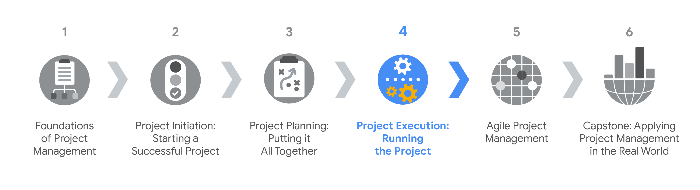
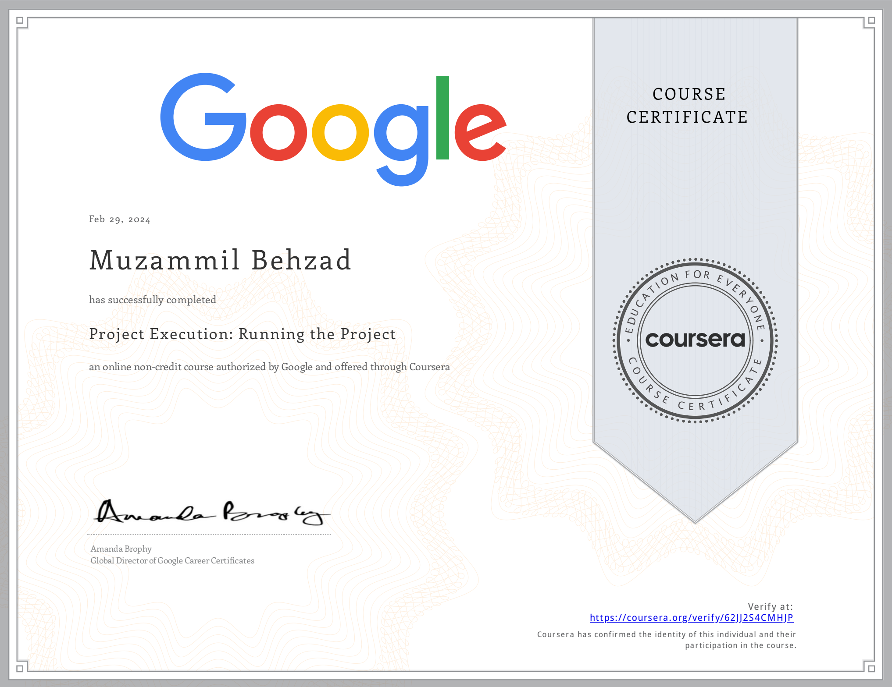

# Project Execution: Running the Project
The knowledge base contanis a specialization overview from the course [Project Execution: Running the Project](https://www.coursera.org/learn/project-execution-google?specialization=google-project-management) by Google on [Coursera](https://www.coursera.org/). It is divided into following modules:
- [Introduction to project execution](./Introduction%20to%20project%20execution.md)
- [Quality management and continuous improvement](./Quality%20management%20and%20continuous%20improvement.md)
- [Data-informed decision-making](.//Data-informed%20decision-making.md)
- [Leadership and influencing skills](./Leadership%20and%20influencing%20skills.md)
- [Effective project communication](./Effective%20project%20communication.md)
- [Closing a project](./Closing%20a%20project.md)

This is the fourth course in the Google Project Management Certificate program. This course will delve into the execution and closing phases of the project life cycle. You will learn what aspects of a project to track and how to track them. You will also learn how to effectively manage and communicate changes, dependencies, and risks. As you explore quality management, you will learn how to measure customer satisfaction and implement continuous improvement and process improvement techniques. Next, you will examine how to prioritize data, how to use data to inform your decision-making, and how to effectively present that data. Then, you will strengthen your leadership skills as you study the stages of team development and how to manage team dynamics. After that, you will discover tools that provide effective project team communication, how to organize and facilitate meetings, and how to effectively communicate project status updates. Finally, you will examine the steps of the project closing process and how to create and share project closing documentation. Current Google project managers will continue to instruct and provide you with hands-on approaches for accomplishing these tasks while showing you the best project management tools and resources for the job at hand.

By the end of this course, you will be able to: 
 - Identify what aspects of a project to track and compare different tracking methods.
 - Discuss how to effectively manage and communicate changes, dependencies, and risks.
 - Explain the key quality management concepts of quality standards, quality planning, quality assurance, and quality control.
 - Describe how to create continuous improvement and process improvement and how to measure customer satisfaction.
 - Explain the purpose of a retrospective and describe how to conduct one. 
 - Demonstrate how to prioritize and analyze data and how to communicate a project’s data-informed story. 
 - Identify tools that provide effective project team communication and explore best practices for communicating project status updates.
 - Describe the steps of the closing process for stakeholders, the project team, and project managers.

[Here](https://www.coursera.org/account/accomplishments/verify/62JJ2S4CMHJP) is my certification for this first course.

## Certification Overview
###  Google Project Management Certification
**Project managers** are natural problem-solvers. They set the plan and guide teammates, and manage changes, risks, and stakeholders. This [Google Project Management: Professional Certificate](https://www.coursera.org/professional-certificates/google-project-management) includes over 140 hours of instruction and hundreds of practice-based assessments which will help you simulate real-world project management scenarios that are critical for success in the workplace. The content is highly interactive and exclusively developed by Google employees with decades of experience in program and project management.

**Skills you’ll gain will include**: Creating risk management plans; Understanding process improvement techniques; Managing escalations, team dynamics, and stakeholders; Creating budgets and navigating procurement; Utilizing  project management software, tools, and templates; Practicing Agile project management, with an emphasis on Scrum.

Through a mix of videos, assessments, and hands-on activities, you’ll get introduced to initiating, planning, and running both traditional and Agile projects. You’ll develop a toolbox to demonstrate your understanding of key project management elements, including managing a schedule, budget, and team.

### Certification Content

The [Google Project Management: Professional Certificate](https://www.coursera.org/professional-certificates/google-project-management) contains six courses.

- Foundations of Project Management
- Project Initiation: Starting a Successful Project
- Project Planning: Putting It All Together
- **Project Execution: Running the Project**
- Agile Project Management
- Capstone: Applying Project Management in the Real World

Most of the content is from the course itself. © Google and Coursera.